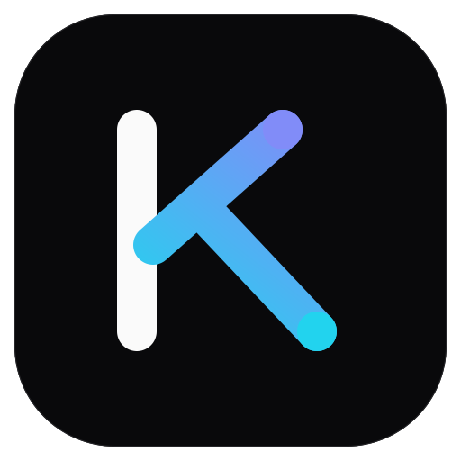

<p align="center">
  
</p>

<p align="center">
  <picture>
    <source media="(prefers-color-scheme: dark)" srcset="https://shieldcn.dev/header/graph.svg?title=Kronik&amp;subtitle=Public+GitHub+activity,+presented+clearly.&amp;logo=github&amp;align=left&amp;font=geist-mono&amp;border=false&amp;mode=dark" />
    
  </picture>
</p>

<p align="center">
  A focused API that turns a GitHub user's public development activity into portfolio-friendly summaries.
</p>

<p align="center">
  <a href="https://github.com/Matthieusz/kronik/actions/workflows/ci.yml"><picture><source media="(prefers-color-scheme: dark)" srcset="https://shieldcn.dev/github/ci/Matthieusz/kronik.svg?workflow=ci.yml&amp;branch=main&amp;variant=secondary&amp;size=xs&amp;mode=dark" /></picture></a>
  <a href="https://github.com/Matthieusz/kronik/stargazers"><picture><source media="(prefers-color-scheme: dark)" srcset="https://shieldcn.dev/github/stars/Matthieusz/kronik.svg?variant=secondary&amp;size=xs&amp;mode=dark" /></picture></a>
  <a href="LICENSE"><picture><source media="(prefers-color-scheme: dark)" srcset="https://shieldcn.dev/github/license/Matthieusz/kronik.svg?variant=secondary&amp;size=xs&amp;mode=dark" /></picture></a>
</p>

## What it does

- Lists public default-branch commits attributed to a GitHub user.
- Summarizes changes and repository language composition over a bounded activity window.
- Reports current and longest contribution streaks.

Built with **TypeScript**, **Effect**, **Bun**, and **Cloudflare Workers**.

## Local development

```bash
bun install
cp .env.example .env
# Add the required credentials to .env
bun dev
```

Run the full verification suite with `bun run verify`.

## License

[MIT](LICENSE)
